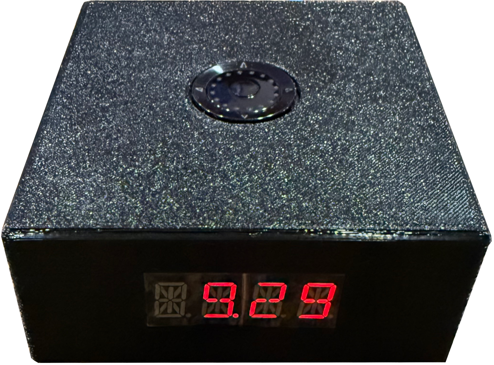

# Clock (Raspberry Pi LED Clock)

A Python-powered nightstand clock for Raspberry Pi Zero 2 W with an I²C LED display and a rotary navigation encoder.  
It syncs time via NTP, supports adjustable brightness, and includes an on-device menu to configure Wi-Fi, time format, timezone, and colon flash.

## ✨ Features

- Accurate time from NTP
- 4-digit HT16K33 LED display (14-segment)
- Smooth brightness control using a rotary encoder
- On-device settings menu:
  - Wi-Fi SSID selection + password entry
  - 12/24-hour mode
  - Timezone selection
  - Colon flash toggle
- Auto-start at boot via systemd
- Clean Python structure (Display class, input handlers, state machine)

## 📷 Photos



## 🧰 Hardware

- **Raspberry Pi Zero 2 W** (other Pis likely work)
- **HT16K33 LED display** (I²C; 0x70 default address)
  https://www.amazon.com/dp/B0C1C5W7V6
- **Adafruit ANO Rotary Navigation Encoder Breakout (PID 6311)**  
  – 2 quadrature pins for rotation, 5 momentary buttons, separate commons
  https://www.adafruit.com/product/6311
- **3D Printed Case** https://www.tinkercad.com/things/d59hjFyJgNW-clock

> Power and logic are 3.3 V. Use internal pull-ups on the Pi GPIO and tie the board’s commons to **GND**.

### Example Wiring

| Encoder Pin | Purpose                    | Pi GPIO (BCM) | Notes                              |
|-------------|----------------------------|---------------|------------------------------------|
| ENCA        | Encoder A                  | GPIO17        | Input w/ internal pull-up          |
| ENCB        | Encoder B                  | GPIO18        | Input w/ internal pull-up          |
| COMA        | Encoder common             | GND           | Tie to Pi ground                    |
| SW1         | Button 1 (up)              | GPIO27        | Input w/ internal pull-up          |
| SW2         | Button 2 (down)            | GPIO23        | Input w/ internal pull-up          |
| SW3         | Button 3 (left)            | GPIO22        | Input w/ internal pull-up          |
| SW4         | Button 4 (right)           | GPIO24        | Input w/ internal pull-up          |
| SW5         | Button 5 (center press)    | GPIO4         | Input w/ internal pull-up          |
| COMB        | Buttons common             | GND           | Tie to Pi ground                    |

**I²C display**

| Display Pin | Purpose     | Pi Header   |
|-------------|-------------|-------------|
| VCC         | 3.3 V       | 3V3         |
| GND         | Ground      | GND         |
| SDA         | I²C data    | GPIO2 (SDA) |
| SCL         | I²C clock   | GPIO3 (SCL) |

## 🖥️ Software Requirements

- Python 3.11+ (Pi OS / Debian Bookworm/Trx)
- `smbus2` (I²C)
- `gpiozero` (inputs)  
  *(or your preferred GPIO library—adjust code accordingly)*

Optional:
- `systemd` (to run at boot)
- `timedatectl` / NTP client (for time sync)

## 🚀 Quick Start

```bash
# 1) Enable I²C (one-time)
# Add this line to /boot/firmware/config.txt and reboot:
#   dtparam=i2c_arm=on
# Then verify:
sudo apt update
sudo apt install -y i2c-tools
i2cdetect -y 1          # should show 0x70 (or your display address)

# 2) Clone the repo (use your own URL)
git clone https://github.com/<your-username>/clock.git
cd clock

# 3) Python venv
python3 -m venv venv
source venv/bin/activate
pip install -U pip
pip install -r requirements.txt  # if present; otherwise:
pip install smbus2 gpiozero

# 4) Run
python clock.py
```

If your display is on a different bus or address, adjust in the code (e.g., `bus=1`, `address=0x70`).

## 🧭 Usage & Controls

- **Default state:** Clock display (updates once per second)
- **Rotate encoder:** Adjust brightness in Clock state
  - Button press (center) → save setting
- **Button press (left/right):** Enter/cycle menu
  - **Wi-Fi SSID** → choose network
    - **Wi-Fi password** → enter using buttons/rotation
  - **12/24-hour** → toggle
  - **Timezone** → choose from curated list
  - **Colon flash** → toggle
  - **Display IP Address**

## 🧷 Systemd (run at boot)

Create `/etc/systemd/system/clock.service`:

```ini
[Unit]
Description=Pi LED Clock
After=network-online.target
Wants=network-online.target

[Service]
Type=simple
User=pi
WorkingDirectory=/home/pi/clock
ExecStart=/home/pi/clock/venv/bin/python /home/pi/clock/clock.py
Restart=on-failure
Environment=PYTHONUNBUFFERED=1

[Install]
WantedBy=multi-user.target
```

Enable it:

```bash
sudo systemctl daemon-reload
sudo systemctl enable --now clock.service
systemctl status clock.service
```

## 📶 Wi-Fi Configuration from the App

You probably configured Wi-Fi when you set up your Pi, but the menu can also scan SSIDs and configure credentials on-device without the need to connect a monitor and keyboard. This can be helpful if you move the clock to a location with a different Wi-Fi network.

**Instructions**
- Select WiFi from the menu and press the center button.
- The clock will scan for available networks. Use the up/down buttons to view the available SSIDs. Press the center button to select the desired SSID.
- The clock will prompt you to enter a password.
  - A single 'a' will be displayed by default
  - Use the up/down buttons or the rotary dial to select the character at the first position.
  - Use the left right arrows to change position. (e.g. select the first character of your password, then press the right arrow to move to the second character and repeat)
  - Press the center button to finish editing.
  - The clock will display the password you entered.
  - Press the left/right buttons to continue editing characters, or press the center button to accept.
  - The clock will display "GOOD" if the SSID and password were valid. The credntials will be saved.
  - The clock will display "FAIL" if the SSID and password were not vailid. Try again.
 
**Note:**
Not all typable characters can be unambiguously displayed on a 14 segment LED display. While accepting characters in the password entry routine, all four digits of the display will be used to identify the exact character being entered. The first three leftmost digits are used to indicate upper/lower case, symobols, etc. The rightmost digit will attempt to display the actual character.

For example, 1, l, i, !, |, ;, and : are all displayed the same on the 14-segment display. While entering the Wi-Fi password, '1' will be shown as "N  1" to indicate that it is a (N)umeral 1. 'l' will be displayed as "↓L l" indicating that it is a lower case L. 'i' will be displayed as "↓I i". '!' will be displayed as "↑1 !", indicating the symbol typed by pressing Shift-1 on a keyboard. And '|' will be displayed as "PIP|" indicating a pipe character. Colon and semicolon are displayed as "COL:" and "SCL;" respectively. All these characters look similar on a single 14-segment display digit. Use the 3 leftmost digits to tell these characters apart.

TLDR: The character displayed on the rightmost digit will be the closest possible 14-segment representation of the character you are entering. The Leftmost 3 digits will idicate uper/lower case or other symbols to disambiguate similarly displayed characters.


## 🧯 Troubleshooting

- **Display shows nothing**
  - `i2cdetect -y 1` should show `0x70` (or your address)
  - Check `dtparam=i2c_arm=on` and SDA/SCL wiring
- **Only some segments light**
  - Verify 14-segment mapping and that you’re writing both high/low bytes per digit
- **Encoder not responding**
  - Confirm you wired **COMA/COMB to GND** and enabled internal pull-ups on ENCA/ENCB/SW*
  - Try swapping A/B if direction feels reversed
- **Buttons double-trigger**
  - Add debounce in code (gpiozero has `bounce_time`), ensure solid ground
- **Permissions**
  - User must be in `i2c` and `gpio` groups on some setups:
    ```bash
    sudo adduser $USER i2c
    sudo adduser $USER gpio
    ```
    Log out/in.

## 🧾 License

GNU GENERAL PUBLIC LICENSE (GPLv3)


